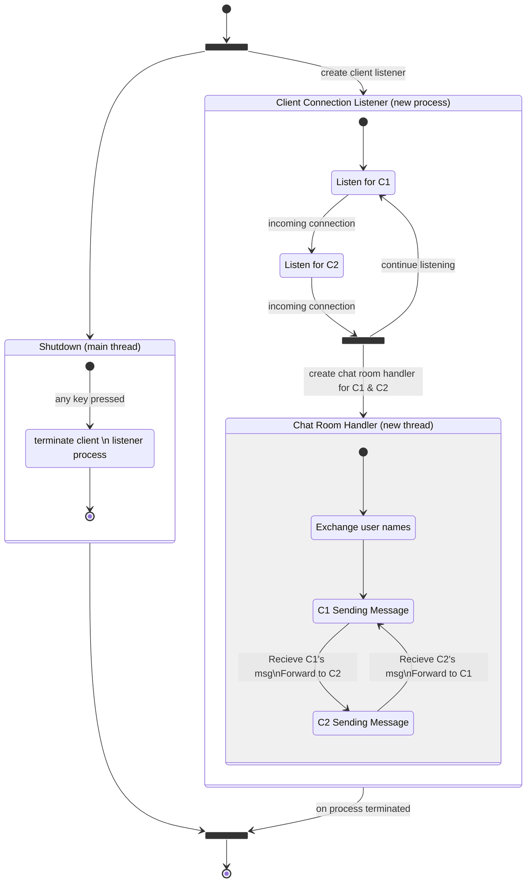

# Chat Server

This chat server is a more complicated usage of multiprocessing and multi-threading in python. The `chat_app.py` script
can be launched either in `server` or `client` mode and will either launch a chat server process or attempt to connect
to an existing one respectively.

The server process listens for incoming connections on a certain port, gathers 2 _(so they can chat with each other)_,
and creates a handler to pass messages back and forth between the 2 clients. It looks something like this:

**Server Process**


---

The following will run the `chat_app.py` demo ***in server mode***. _(the `Set-Item` command at the beginning adds the project
root to the python path so that the following script can be run from this current directory)_
```shell
Set-Item -Path Env:PYTHONPATH -Value ($Env:PYTHONPATH + ";" + ((Get-Item .).parent.parent.parent.FullName) + ";");

python chat_app.py server
```

The following will run the `chat_app.py` demo ***in client mode***. _(the `Set-Item` command at the beginning adds the project
root to the python path so that the following script can be run from this current directory)_
```shell
Set-Item -Path Env:PYTHONPATH -Value ($Env:PYTHONPATH + ";" + ((Get-Item .).parent.parent.parent.FullName) + ";");

python chat_app.py client
```
