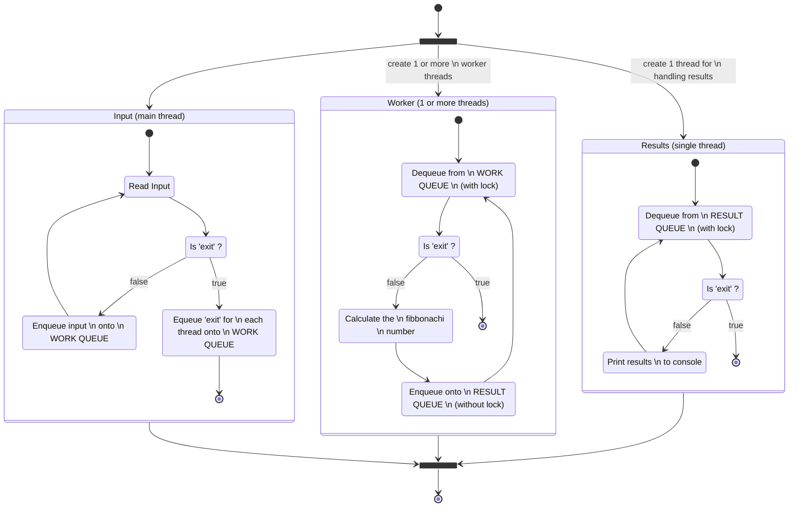

# Python in Parallel

## Invoking Another Script (or command)

The `subprocess` module can be very helpful for quickly spinning up a subprocess to execute some program, whether 
python or something else.
As per [the documentation](https://docs.python.org/3/library/subprocess.html#using-the-subprocess-module), the
recommended usage is the `run` method where possible, falling back to `Popen` otherwise:

> The recommended approach to invoking subprocesses is to use the `run()` function for all use cases it can handle. 
> For more advanced use cases, the underlying `Popen` interface can be used directly.

The `invoke_another_argument.py` python script in this module can be run to see example usages of these two approaches:
```shell
python invoke_another_script.py
```
Result:
```text
--- Invoke fibonacci.py with a command line argument using subprocess.run()
> stdout = run(["python", "fibonacci.py", "25"], text=True, capture_output=True).stdout
stdout: 75025

--- Invoke fibonacci.py with an argument passed to stdin using subprocess.run()
> stdout = run(["python", "fibonacci.py"], input="25", text=True, capture_output=True).stdout
stdout: 75025

--- Invoke fibonacci.py with a command line argument using subprocess.Popen
> stdout, _ = Popen(["python", "fibonacci.py", "25"], text=True, stdout=PIPE, stdin=PIPE, stderr=STDOUT).communicate()
stdout: 75025

--- Invoke fibonacci.py with an argument passed to stdin using subprocess.Popen
> stdout, _ = Popen(["python", "fibonacci.py"], text=True, stdin=PIPE, stdout=PIPE, stderr=STDOUT).communicate(input="25")
stdout: 75025
```

## Workers with Multithreading

The `threading` module provides an easy way to get into working with threads. In trivial cases, cross thread
'communication' can even be achieved by invoking methods or reading variable references across threads. This of course
can be dangerous and not 'thread safe'. A better way is to use something like the `queue.Queue` class which is designed
to allow enqueuing and dequeuing of data in a thread safe way, and can be done either with or without a 'lock'.

To use a `Queue`, create it prior to the thread and then pass it as an argument when creating the thread. For example:
```python
from queue import Queue
from threading import Thread

def worker(queue: Queue[int]) -> None:
    while True:
        num = queue.get()
        if num < 0: 
            break
        print(num)

work_queue: Queue[int] = Queue()
worker_thread = Thread(target=worker, args=(work_queue,))

for i in range(10):
    work_queue.put_nowait(i)
work_queue.put_nowait(-1)

worker_thread.join()
```

The `thread_based_workers.py` script demonstrates how a pool of thread-based workers can be spun up and passed work. It
works something like this:



The following will run the `thread_based_worker.py` demo. _(the `Set-Item` command at the beginning adds the project
root to the python path so that the following script can be run from this current directory)_
```shell
Set-Item -Path Env:PYTHONPATH -Value ($Env:PYTHONPATH + ";" + ((Get-Item .).parent.parent.FullName) + ";");

python thread_based_workers.py
```

## Workers with Multiprocessing


```shell
python thread_based_workers.py
```