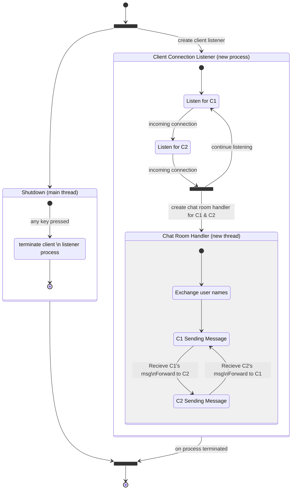

# Tic-Tac-Toe Game Server

**Server Process**

```mermaid
stateDiagram-v2

CloseServer: Shutdown (main thread)
ClientListener: Client Connection Listener (new process)
state ServerStartupFork <<fork>>

[*] --> ServerStartupFork
ServerStartupFork --> CloseServer
ServerStartupFork --> ClientListener: create client listener

state CloseServer {
    StopServer: terminate client \n listener process
    [*] --> StopServer: any key pressed
    StopServer --> [*]
}

state ClientListener {
    Conn1Listener: Listen for C1
    Conn2Listener: Listen for C2
    state CreateHandlerFork <<fork>>
    ChatRoomHandler: Chat Room Handler (new thread)
    
    [*] --> Conn1Listener
    Conn1Listener --> Conn2Listener: incoming connection
    Conn2Listener --> CreateHandlerFork: incoming connection
    CreateHandlerFork --> Conn1Listener: continue listening
    CreateHandlerFork --> ChatRoomHandler: create chat room handler for C1 & C2 
    
    state ChatRoomHandler {
        NameExchange: Exchange user names
        C1Msg: C1 Sending Message
        C2Msg: C2 Sending Message
        
        [*] --> NameExchange
        NameExchange --> C1Msg
        C1Msg --> C2Msg: Recieve C1's msg\nForward to C2
        C2Msg --> C1Msg: Recieve C2's msg\nForward to C1
    }
}

state ServerShutdownJoin <<join>>
CloseServer --> ServerShutdownJoin
ClientListener --> ServerShutdownJoin: on process terminated
ServerShutdownJoin --> [*]
```
